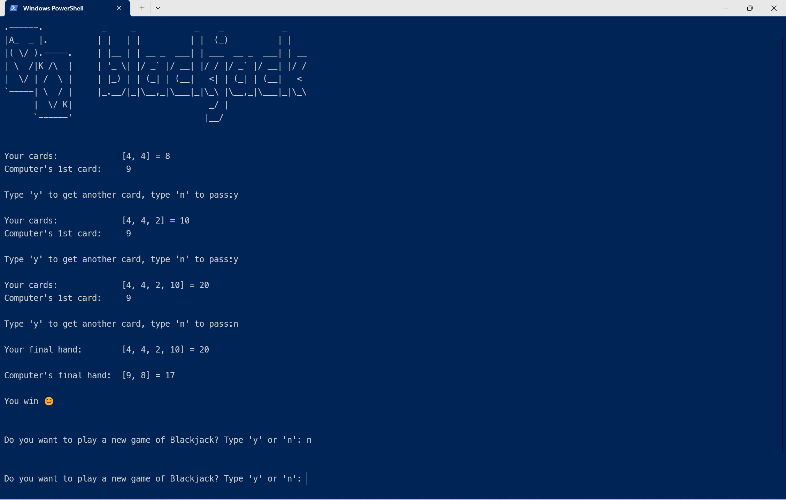

# Blackjack Game
 blackJack is a Python card game where the goal is to get cards that add up to as close to 21 as possible without going over and competing with the computer.

## Features
The game deals cards and calculates the total value of the player's and computer's hands. It allows the player to choose whether to ask for another card (receive another card) or (keep the current card). It then automatically plays the computer's hand according to standard Blackjack rules.

## Screenshots 📸

## Requirements 🔧
Python 3.12.3. or higher

## Installation 🔌
1. Press the Fork button (top right of the page) to save a copy of this project on your account.

2. Download the repository files (project) from the download section or clone this project by typing in the bash the following command:

    git clone https://github.com/CoderValentina/blackJackGame.git

3. Open it in Visual Studio Code.

4. Run the program :)

## Contributing 💡
If you'd like to contribute to this project and enhance it with new ideas, your pull request is greatly appreciated. If you encounter any issues, please don't hesitate to report them in the repository's issue section. Thank you!

## Thank you! 😊
Please ⭐️ this repo and share it with others.